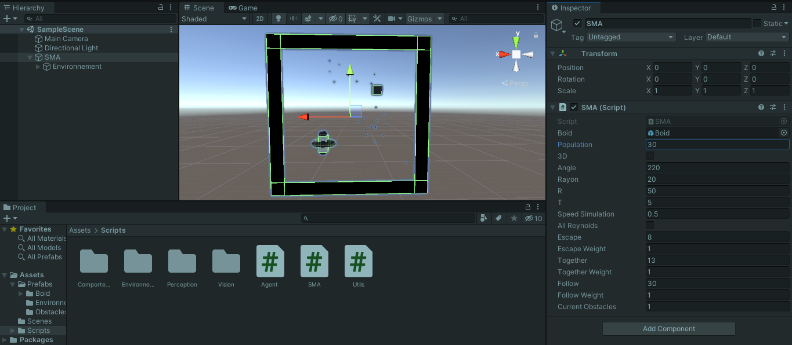
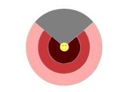

# **Documentation Technique : Flocking Simulator**

[**↩️ Retour à l'accueil**](../../README.md)

Bienvenue dans la documentation technique du projet Flocking Simulator ! Cette documentation technique vous servira à mieux comprendre pour mieux utiliser ce simulateur pour mettre en place des comportements de nuées d'oiseaux !

<h2 id="0"> <strong>Sommaire</strong> </h2>

1. <a href="#1"> <strong> Comment utiliser le simulateur Flocking Simulator ? </strong> </a>
2. <a href="#2"> <strong> Fonctionnement des Agents </strong> </a>
   1. <a href="#21"> <strong> Perception </strong> </a>
   2. <a href="#22"> <strong> Comportement actuel </strong> </a>
   3. <a href="#23"> <strong> Ajout de comportement </strong> </a>
3. <a href="#3"> <strong> Comment ajouter des obstacles ? </strong> </a>
4. <a href="#4"> <strong> Diagramme UML du projet </strong> </a>
5. <a href="#5"> <strong> Classes </strong> </a>

<h2 id="1"> <strong> 1. Comment utiliser le simulateur Flocking Simulator ? </strong> <a href="#0">↩️</a> </h2>

 

Pour utiliser ce simulateur, il vous faudra la version **2020.3.31f1** du logiciel **Unity**.
Il vous faudra l'utiliser sous l'onglet Scene.
La raison de l'utilisation de ce simulateur par l'onglet Scene d'Unity est qu'il vous sera ainsi possible d'intégrer de nouveaux comportements aux agents (expliqué en <a href="#2">2.</a>).

Ainsi, il vous importer (Assets > Import Package > Custom Package...) le package vFinal.unitypackage qui se situe au dossier [src/Packages](../../src/Packages/vFinal.unitypackage) pour lancer en mode Play (bouton centré en haut de fenêtre) et avoir le simulateur comme ceci :

 

 

 

Lorsque le simulateur est lancé, vous pouvez en effet jouer sur les paramètres en temps réel. En voici la liste et leur rôle : 

 

 

* **Boid** : le prefab correspondant aux agents, ne pas le modifier à moins que vous utilisiez un nouveau prefab avec un composant avec le script [Agent.cs](../../src/Scripts/Agent.cs)
* **Population** : le nombre actuel d'agent Boid dans la simulation (le modifier pour avoir plus ou moins de Boids)
* **3D** : cocher cette case pour que la simulation se passe dans un environnement 3D
* **Angle** : angle courant de vision des agents (voir <a href="#21">2.1</a>)
* **Rayon** : rayon courant de vision des agents (voir <a href="#21">2.1</a>)
* **R** : constante de force de répulsion des obstacles (voir <a href="#22">2.2</a>)
* **T** : constante de force en tangente des obstacles (voir <a href="#22">2.2</a>)
* **Speed Simulation** : vitesse actuelle de la simulation
* **All Reynolds** : si coché, on considère les règles de Reynolds en disque et non en arc de disque (voir <a href="#22">2.2</a>)
* **Escape** : distance maximum à laquelle on applique la règle de séparation (voir <a href="#22">2.2</a>)
* **Escape Weight** : poids de la séparation (voir <a href="#22">2.2</a>)
* **Together** : distance maximum à laquelle on applique la règle d'alignement (voir <a href="#22">2.2</a>)
* **Together Weight** : poids de l'alignement (voir <a href="#22">2.2</a>)
* **Follow** : distance maximum à laquelle on applique la règle de cohésion (voir <a href="#22">2.2</a>)
* **Follow Weight** : poids de la cohésion (voir <a href="#22">2.2</a>)
* **Current Obstacles** : pattern courant des obstacles (soit 1, il y a des obstacles, sinon il n'y en a pas) (voir <a href="#3">3.</a>)

<h2 id="2"> <strong> 2. Fonctionnement des Agents </strong> <a href="#0">↩️</a></h2>

Un agent Boïd est défini par sa **perception** de son environnement et par son **comportement**, ses interactions avec l'environnement et avec les autres agents. Bien qu'on utilise les mêmes scripts pour chacun des agents, leurs positions et donc leurs perceptions seront différentes et ils agiront donc chacun différemment des autres. C'est par cette différence qu'il sera intéressant de visualiser les phénomènes émergeants qui se peuvent se créer à partir des interactions des agents, comme par exemple, un vol en nuée.

<h3 id="21"> <strong> 2.1 Perception </strong> </h3>

 

 

La perception d'un agent est donc défini par l'agent propriétaire, un angle de vision et un rayon de vision (modifiable en temps réel lors de la simulation). Cette perception de l'environnement par l'agent permettra de renvoyer une liste d'observations qui sera traité par l'agent propriétaire afin qu'il agisse en conséquence.

<h3 id="22"> <strong> 2.2 Comportement actuel </strong> </h3>

Un comportement d'agent, quelqu'il soit, hérite de la classe abstraite Comportement. Il doit être instancié en fonction d'un agent auquel il appartient et il doit implémenter une méthode qui renvoie un vecteur de déplacement en fonction d'une liste d'observation.

À l'utilisation sans modification du simulateur, les agents sont dôtés d'un comportement composite, composé de 3 comportements différents : Reynolds, TangenteBord2 et Aleatoire.

Le comportement composite permet d'additionner les déplacements indiqués par les comportements qui le composent selon des poids indiqués et de normaliser le déplacement somme. Actuellement, Reynolds et TangenteBord2 ont un poid 10 fois plus élevé que Aleatoire.

Aussi, lorsque l'environnement est contraint d'être en 2 dimensions, le comportement Constrain2D sera utilisé pour contraindre le comportement composite à renvoyer un déplacement en 2 dimensions.

Pour mieux comprendre ce que cela signifie, voici le descriptif des comportements déjà présents dans le projet :

* Constrain2D : se construit en fonction d'un comportement, renverra le déplacement du comportement mais contraint en 2 dimensions

* CompositeSum : se construit en fonction d'une liste de comportements et une liste d'importances, additionne les réponses des comportements selon les poids d'importances et renvoie la somme 

* Reynolds : applique les règles de Reynolds (voir [détails article](../../media/reynolds.pdf) ou [détails en ligne](https://gamedevelopment.tutsplus.com/tutorials/3-simple-rules-of-flocking-behaviors-alignment-cohesion-and-separation--gamedev-3444)) selon les autres agents observés et selon les constantes modifiables depuis le système

* TangenteBord2 : applique une réponse aux bords d'environnements, la réponse est une répulsion (R / distance² ) et un mouvement en tangente (T / distance)

* Aleatoire : renvoie un mouvement aléatoire

* Constant : renvoie le déplacement déjà effectué par le propriétaire

* Bord : applique une réponse aux bords d'environnements, la réponse est une répulsion (R / distance² )

* TangenteBord1 : applique une réponse aux bords d'environnements, la réponse est une répulsion (R / distance² ) et un mouvement en tangente (R / distance)

* CompositeMean : Hérite de CompositeSum et renvoie la moyenne au lieu de la somme

* Paper : amorce du comportement du [papier scientifique](../../media/paper.pdf)

<h3 id="23"> <strong> 2.3 Ajout de comportement </strong> <a href="#0">↩️</a> </h3>

Comme décrit précédemment, un comportement doit hériter de la classe abstraite [**Comportement**](./Classes/Base/Comportement.md) (public class NomClass : Comportement), doit être instancier au minima avec l'agent propriétaire de celui ci et doit implémenter la méthode suivante :

> public Vector3 reagir(List< Observation > observation);

Méthode qui prend en paramètre une liste d'[**Observation**](./Classes/Vision/Observation.md) et qui renvoie un vecteur de déplacement en réponse.

Une fois une telle classe héritante de Comportement, vous pourrez l'intégrer à un Agent.

Dans la fonction Start dans la classe Agent, vous trouverez ceci :

        // début Comportement modifiable

        *Code affectation comportement*

        // fin Comportement modifiable

Dans cet espace, vous pourrez aisément affecter l'attribut **comportement** de l'agent avec votre nouveau comportement. Vous pouvez également utiliser votre nouveau comportement à travers un comportement CompositeSum comme dans cet exemple :

        // début Comportement modifiable

        List<Comportement> comps = new List<Comportement> { 
            new TangenteBord2(this),new Reynolds(this), new Aleatoire(this)
        };
        List<int> imps = new List<int> { 
            10,10,1 
        };
        Comportement c =  new CompositeSum(this,comps,imps);

        // fin Comportement modifiable

Ici les comportements de TangenteBord2, Reynolds et Aleatoire sont utilisés avec des poids de 10, 10 et 1.

<h2 id="3"> <strong> 3. Comment ajouter des obstacles ? </strong> <a href="#0">↩️</a> </h2>

Dans la simulation, l'environnement possède lui-également des attributs publics paramétrables

 

 

En effet, il a plusieurs GameObject en paramètres :

 

 

* **Cube** : Correspond à la topologie 3D de l'environnement, vous pouvez le modifier, mais il est supposé cubique. S'il ne l'est pas, cela peut perturber la simulation
* **Carre** : Correspond à la topologie 2D de l'environnement, vous pouvez le modifier, mais il est supposé carre. S'il ne l'est pas, cela peut perturber la simulation
* **Figures** : Il s'agit d'une liste que vous pouvez remplir de GameObject (pas besoin de script attaché dessus) afin de donner des esthétiques aux obstacles

Ensuite, après avoir ajouté les obstacles voulus dans **Figures**, vous pourrez vous intéresser à la fonction **getPattern** de la classe [**Environnement**](./Classes/Environnement/Environnement.md)

    public List<CustomObstacle> getPattern(int i) {
         if (i == 1) {
              return new List<CustomObstacle> {
                  new CustomObstacle(this,new Vector3(-20.0f,20.0f,0.0f),figures[Utils.random(0,figures.Length)]), 
                  new CustomObstacle(this,new Vector3(20.0f,-20.0f,0.0f),figures[Utils.random(0,figures.Length)]) };
          }
          else return new List<CustomObstacle>();
      }

Cette fonction consiste à retourner une liste de [**CustomObstacle**](./Classes/Environnement/Obstacle/CustomObstacle.md) que l'environnement utilisera. Un [**CustomObstacle**](./Classes/Environnement/Obstacle/CustomObstacle.md) se construit donc à partir de l'environnement auquel il appartient, la position de celui ci dans l'environnement et de son esthétique, du GameObject associé (qui peut être disposé dans **Figures**).

<h2 id="4"> <strong> 4. Diagramme UML du projet </strong> <a href="#0">↩️</a> </h2>

Voici le diagramme UML de la conception du Flocking Simulator :

 

 

<h2 id="5"> <strong> 5. Classes </strong> <a href="#0">↩️</a> </h2>

Voici les pages de documentation des différentes classes du projet :

* [**Utils**](./Classes/Utils.md)
* [**SMA**](./Classes/SMA.md)
* [**Agent**](./Classes/Agent.md)
* **./Environnement**
  * [**Environnement**](./Classes/Environnement/Environnement.md)
  * **./Obstacle**
    * [**Obstacle**](./Classes/Environnement/Obstacle/Obstacle.md)
    * [**PointObstacle**](./Classes/Environnement/Obstacle/PointObstacle.md)
    * [**CustomObstacle**](./Classes/Environnement/Obstacle/CustomObstacle.md)
  * **./Topologie**
    * [**Topologie**](./Classes/Environnement/Topologie/Topologie.md)
    * [**Cube**](./Classes/Environnement/Topologie/Cube.md)
    * [**Carre**](./Classes/Environnement/Topologie/Carre.md)
* **./Perception**
  * [**Perception**](./Classes/Perception/Perception.md)
  * [**Perception90**](./Classes/Perception/Perception90.md)
  * [**Perception180**](./Classes/Perception/Perception180.md)
  * [**Perception360**](./Classes/Perception/Perception360.md)
* **./Vision**
  * [**Observation**](./Classes/Vision/Observation.md)
  * [**Visible**](./Classes/Vision/Visible.md)
* **./Comportement**
  * **./Base**
    * [**Aleatoire**](./Classes/Base/Aleatoire.md)
    * [**Comportement**](./Classes/Base/Comportement.md)
    * [**Constant**](./Classes/Base/Constant.md)
  * **./Bord**
    * [**Bord**](./Classes/Bord/Bord.md)
    * [**TangenteBord1**](./Classes/Bord/TangenteBord1.md)
    * [**TangenteBord2**](./Classes/Bord/TangenteBord2.md)
  * **./Composite**
    * [**CompositeSum**](./Classes/Composite/CompositeSum.md)
    * [**CompositeMean**](./Classes/Composite/CompositeMean.md)
  * **./Contrainte**
    * [**Constrain2D**](./Classes/Contrainte/Constrain2D.md)
  * **./Papers**
    * [**Reynolds**](./Classes/Papers/Reynolds.md)
    * [**Paper**](./Classes/Papers/Paper.md)

